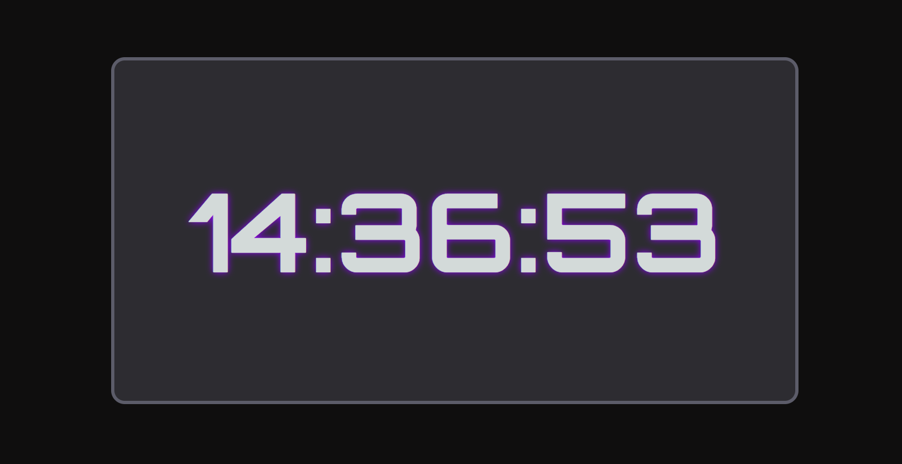

<h1>⏰ Digital Clock</h1>

A simple digital clock built with HTML, CSS, and JavaScript.
It displays the current time in HH:MM:SS format and updates every second.

 
<h2>🖼️ Preview</h2>

  

 
<h2>🚀 Features</h2>
<ul>
  <li>Real-time updating clock</li>
  <li>Leading zero formatting (e.g., 07:05:09 instead of 7:5:9)</li>
  <li>Styled with glowing effect using CSS</li>
  <li>Easy to customize (fonts, colors, background, format)</li>
</ul>
 
<h2>🛠️ Technologies Used</h2>
<ul>
  <li>HTML5 → structure</li>
  <li>CSS3 → styling (glow, layout, fonts)</li>
  <li>JavaScript (ES6) → real-time updates</li>
</ul>
 
<h2>⚡ How to Run</h2>
<ol>
  <li>Clone or download this repository.</li>
  <li>Open index.html in your browser.</li>
  <li>The clock will start automatically.</li>
</ol>
 
<h2>📜 License</h2>

This project is free to use and modify for learning or personal purposes.

